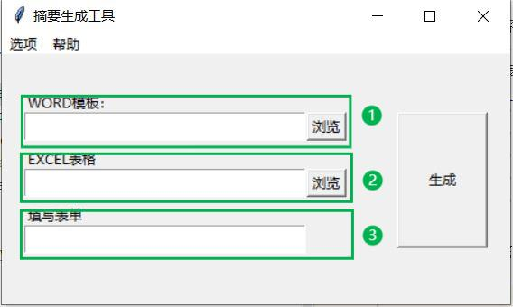
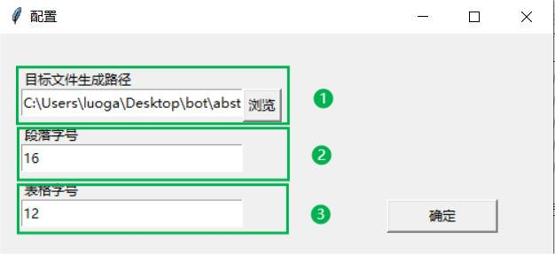

# 简介

摘要生成工具是一个根据Word模板将Excel文件整合成一段摘要文字的桌面小工具。该工具支持高度自定义的摘要内容以及丰富的数据计算函数，并以Word文档的格式展现最终结果。

# 使用方法

## Excel文档

需要准备一个Excel工作簿作为数据来源。该工作簿需要包含至少一个工作表（Sheet），若有多个工作表需要格式保持一致。比如，每个工作表的表头、列名、行名都一致，但是内容分别刻画不同阶段的数据。具体参考`test/2022年7月能源统计数据.xlsx`。`

## Word模板

需要准备一个Word文档作为模板。除了必要的描述性的摘要文字，数据部分需要用一对大括号`{}`来引用上述Excel文档中的内容。大括号中具体内容如下：

|括号内容|引用内容|举例|
|:------|:------|:------|
|{row,col}|工作表列表内最后一张表中，行号为row，列号为col的数据|{2，C}|
|{row,col,sheet_name}|sheet_name工作表中，行号为row，列号为col的数据|{2,C,Sheet1}|
|{SUM(row,col)}|工作表列表内所有行号为row，列号为col的数据的总和|{SUM(5,B)}|
|{AVG(row,col)}|工作表列表内所有行号为row，列号为col的数据的平均值，未实现|{AVG(5,B)}|
|{MAX(row,col)}|工作表列表内所有行号为row，列号为col的数据的最大值，未实现|{MAX(5,B)}|
|{MIN(row,col)}|工作表列表内所有行号为row，列号为col的数据的最小值，未实现|{MIN(5,B)}|
|{CMP(row,col)}|工作表列表内最后一张表中，行号为row，列号为col的数据的环比增量（与前一张表相比），未实现|{CMP(5,B)}|

目前部分功能有待完善，且大括号内的内容必须严格按照定义书写，列名必须大写，逗号必须是半角逗号，且不能有空格。具体参考`test/2022年下半年能源统计数据摘要.docx`

## 工具使用

①：点击“浏览”选择Word模板文档
②：点击“浏览”选择Excel工作簿文档
③：填写工作表列表，即文档中Sheet的名称，用半角逗号隔开，比如202207,202208,202209
最后点击“生成”按钮在同名目录下生成摘要文档

①：点击“浏览”选择生成摘要存放的目录
②：选择段落文字的大小，单位为磅
③：选择表格文字的大小，单位为磅
最后点击“确定”保存更改
